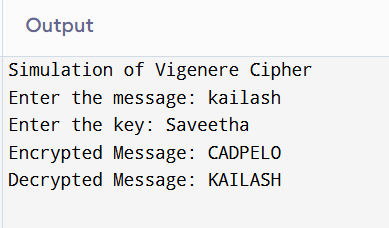

# VIGENERE-CIPHER
## EX. NO: 1(D)
 

## IMPLEMETATION OF VIGENERE CIPHER
 

## AIM:

To implement the Vigenere Cipher substitution technique using C program.

## DESCRIPTION:

To encrypt, a table of alphabets can be used, termed a tabula recta, Vigenère square,or Vigenère table. It consists of the alphabet written out 26 times in differnt rows, each
 
alphabet shifted cyclically to the left compared to the previous alphabet, corresponding to the 26 possible Caesar ciphers. At different points in the encryption process, the cipher uses adifferent alphabet from one of the rows. The alphabet used at each point repeating keyword.depends on a Each row starts with a key letter. The remainder of the row holds the letters A to Z. Although there are 26 key rows shown, you will only use as many keys as there are unique letters in the key string, here just 5 keys, {L, E, M, O, N}. For successive letters of the message, we are going to take successive letters of the key string, and encipher each message letter using its corresponding key row. Choose the next letter of the key, go along that row to find the column heading that	atches the message character; the letter at the intersection of
[key-row, msg-col] is the enciphered letter.


## ALGORITHM:
```
STEP-1: Arrange the alphabets in row and column of a 26*26 matrix.
STEP-2: Circulate the alphabets in each row to position left such that the first letter is attached to last.
STEP-3: Repeat this process for all 26 rows and construct the final key matrix.
STEP-4: The keyword and the plain text is read from the user.
STEP-5: The characters in the keyword are repeated sequentially so as to match with that of the plain text.
STEP-6: Pick the first letter of the plain text and that of the keyword as the row indices and column indices respectively.
STEP-7: The junction character where these two meet forms the cipher character.
STEP-8: Repeat the above steps to generate the entire cipher text.
```

## PROGRAM
```C
#include <stdio.h>
#include <string.h>
#include <ctype.h>

void vigenere_encrypt(char *msg, char *key, char *enc) {
    int msgLen = strlen(msg), keyLen = strlen(key);
    for (int i = 0, j = 0; i < msgLen; i++) {
        if (isalpha(msg[i])) {
            enc[i] = ((toupper(msg[i]) - 'A' + toupper(key[j % keyLen]) - 'A') % 26) + 'A';
            j++;
        } else {
            enc[i] = msg[i];
        }
    }
    enc[msgLen] = '\0';
}

void vigenere_decrypt(char *enc, char *key, char *dec) {
    int encLen = strlen(enc), keyLen = strlen(key);
    for (int i = 0, j = 0; i < encLen; i++) {
        if (isalpha(enc[i])) {
            dec[i] = ((toupper(enc[i]) - 'A' - (toupper(key[j % keyLen]) - 'A') + 26) % 26) + 'A';
            j++;
        } else {
            dec[i] = enc[i];
        }
    }
    dec[encLen] = '\0';
}

int main() {
    char msg[1000], key[100];
    char enc[1000], dec[1000];
    
    printf("Simulation of Vigenere Cipher\n");
    printf("Enter the message: ");
    scanf(" %s", msg);
    printf("Enter the key: ");
    scanf(" %s", key);
    
    vigenere_encrypt(msg, key, enc);
    printf("Encrypted Message: %s\n", enc);
    
    vigenere_decrypt(enc, key, dec);
    printf("Decrypted Message: %s\n", dec);
    
    return 0;
}
```
## OUTPUT

## RESULT
The program has been executed successfully
